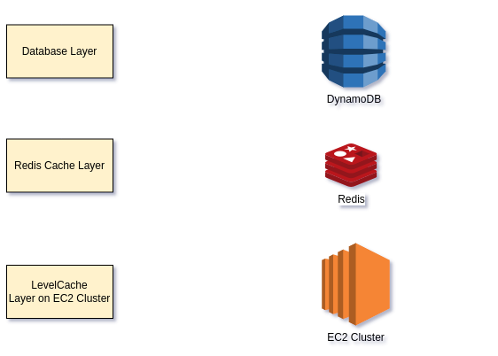

# LevelCache

**LevelCache** is a thread-safe, dynamic multi-level caching system designed to efficiently manage data across various cache layers. It supports the dynamic addition of cache levels, multiple eviction policies, and concurrent read/write operations, ensuring optimized data retrieval across levels.

Multilevel caching strategies are commonly found in hardware systems (e.g., computer processors, CDNs, web servers) to balance the trade-offs between speed, memory capacity, and cost. Each level stores data at different speeds and capacities, with higher levels (closer to the processor) being faster but smaller, while lower levels are slower but larger.


The prototype requirements can be found [here](doc/requirements.md).

## Design Considerations

The system's design emphasizes flexibility, efficiency, and scalability. A key aspect is the use of the builder pattern via `ConfigurationBuilder`, which allows for seamless customization of cache-related settings for each `LevelCache` instance. 

At the core of the system is the `CacheFactory`, responsible for creating and initializing `LevelCache` instances based on the specified configurations. The `LevelCache` class offers a well-defined API, supporting operations such as adding and removing cache levels, storing and retrieving data, displaying cache states, and performing bulk reads/writes.

Each cache level is efficiently managed through `CacheUnit`, which holds the level's details and supports multiple eviction policies, making it highly extensible. The `CacheUnitProvider` supplies pre-configured `CacheUnit` instances with the appropriate eviction policy  using `StorageEngine`, which dictates how the cache handles storage and key-value invalidation.

Overall, the system is built for extensibility, supporting dynamic cache levels and eviction policies, and promotes loose coupling through the use of the `DefaultConfigBuilder`.

See [here](doc/levelcache.png) to get an overview of the system.

# Prerequisite
* JDK 1.8
* Maven
* Junit 5

# Setup
```bash
# Get the code
$ git clone https://github.com/s-bose7/levelcache.git .
# Install maven dependencies
$ mvn clean install
# Run the tests
$ mvn test
```

# Usage and Example

Imagine a system where data is stored in Postgres/dynamoDB, but certain data becomes highly popular during peak traffic periods. In such cases, it's beneficial to introduce Redis or ElastiCache between your web application and the database, and to use one or multiple instances of LevelCache within your application to minimize unnecessary network calls.



## Cache Initialization
```java
public class App {
    public static void main( String[] args ) throws CacheInitializationException {
        // CREATE THE CACHE CONFIGURATION
    	CacheConfiguration cacheConfiguration = new ConfigurationBuilder()
            .setCacheName("levelcache-v1-ins-x86_64-5679-evict-dynamic")
            .setLoggingEnabled(true)
            .setConcurrencyLevel(5)
            .setMaxCacheLevels(100)
            .setKeyType(String.class)
            .setValueType(String.class)
            .build();
        
    	// INITIALIZE THE CACHE USING CACHE FACTORY
    	LevelCache cache = CacheFactory.createCache(cacheConfiguration);
	cache.addLevel(3, "LRU");
	cache.addLevel(2, "LFU");

    	// ONE CAN USE THE DEFAULT CONFIGURATION BUILDER AS WELL TO INITIALIZE LEVELCACHE
    	LevelCache cache2 = CacheFactory.createCache(DefaultConfigBuilder.getDefaultConfiguration());
	cache.addLevel(10, "LFU");
	cache.addLevel(26, "LRU");
    }
}
```
# Benchmarks
The `com/levelcache/benchamrk/Benchmark.java` file contains some benchmarks about the cache performance.

# Appendix
If you found this design intriguing, feel free to explore my other similar caching system designs [here](https://github.com/s-bose7/memcache) and [here](https://github.com/s-bose7/memcache-client).
