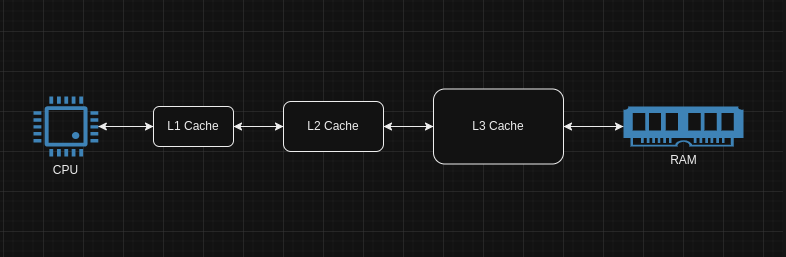

# levelcache

Levelcache is a thread-safe, dynamic multi-level caching system designed to efficiently manage data across various cache layers. It supports the dynamic addition of cache levels, hybrid eviction policies, and concurrent read/write operations, ensuring optimized data retrieval across levels.

Multilevel caching strategies ideally found in hardware systems (i.e. Computer Processors, CDNs, Web servers) to balance the trade-offs between speed, memory capacity, and cost. Each level stores data at different speeds and capacities, with higher levels (closer to the processor) being faster but smaller, and lower levels being slower but larger.

# Prerequisite
* JDK 1.8
* Maven
* Junit 5

